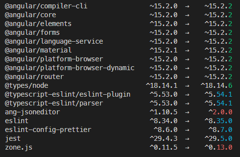

# **OrbitalDesigner**

- This project was generated with [Angular CLI](https://github.com/angular/angular-cli) version 8.0.2.

## **Development server**

- Run `npm run start` to start the designer app locally. Navigate to `http://localhost:4200/`. The app will automatically reload if you change any of the source files.

## **Code scaffolding**

- Run `ng generate component component-name` to generate a new component. You can also use `ng generate directive|pipe|service|class|guard|interface|enum|module`.

## **Build**

- Run `npm run build` to build the project. The build artifacts will be stored in the `dist/` directory. Use the `--prod` flag for a production build.

## **Running unit tests**

- Run `npm run test` to execute the unit tests via [Jest](https://jestjs.io/docs/testing-frameworks).

- NOTE: If running into performance issues while executing tests (particularly if working within dev containers), execute `npm run test:watch` to run optimized tests

## **Further help**

- To get more help on the Angular CLI use `ng help` or go check out the [Angular CLI README](https://github.com/angular/angular-cli/blob/master/README.md).

## **Updating Dependencies**

### **Checking dependencies due for upgrade/updates**

#### **Using npm**

- Run `npm outdated` to generate a list of root level dependencies (and dev dependencies) that are available for upgrade

- Any dependencies can be be upgraded with running [`npm update <PACKAGE-NAME>@<OPTIONAL-SPECIFIC-VERSION`](https://docs.npmjs.com/cli/v8/commands/npm-update) for packages conforming to semver versioning and the projects dependency tree

#### **Using npm-check-updates aka ncu**

- Install [`npm-check-updates`](https://www.npmjs.com/package/npm-check-updates) with `npm i npm-check-updates -g`

- Run `npm-check-updates` or `ncu` to list what packages are out of date (equivalent to running `npm outdated`)

- The output will list the packages that require updating, but colour-code the `MAJOR.MINOR.PATCH` versioning for further inspection. NOTE: this **excludes** peer dependencies
  
- Run `npm-check-updates -u` to update all the versions in your `package.json`

- Run `npm install` to resolve the projects dependency tree lock file based on the updated `package.json`

#### **Dependency conflicts**

- For this project it is **strongly recommended** that any conflicting dependencies are resolved without bypassing package `peerDependencies` using `npm install | npm i` or `npm ci` in conjuction with either `--force` or `--legacy-peer-deps` flags as passing unresolved dependencies may introduce breaking changes

- Run [`npm ls`](https://docs.npmjs.com/cli/v7/commands/npm-ls) to review the root-level packages, `npm ls -all` to output the projects full dependency tree and `npm explain <PACKAGE-NAME>` for a bottoms up view of it's peer dependencies.

### **Angular**

- Angular can be updated using the Angular CLI. Note: The CLI can only update from one major version to the next. If the app is more than one version behind, it can be updated in multiple steps using the CLI.

- Update command:

```
npx @angular/cli@<VERSION> update @angular/core@<VERSION> @angular/cli@<VERSION>
```

- Example to update to Angular `v15`:

```
npx @angular/cli@15 update @angular/core@15 @angular/cli@15
```

- Angular Material can also be updated in a subsequent step:

```
npx @angular/cli@15 update @angular/material@15
```

- Note: Using `npx @angular/cli@<version> update` uses the ng cli version specified, but if the desired version is already installed, then `ng update` can simply be used, followed by the packages to be updated: i.e:

```
ng update @angular/cli @angular/core @angular/cdk @angular-eslint/schematics @angular/material
```

- Note: `ng update` alone will list the packages that have available updates and are supported by the `ng update` command

#### **Current Dependencies constrained to specific versions**

- Angular Material has a direct peer dependency on a specific version of Angular CDK. Therefore, any future upgrades of Angular Material will need to also upgrade Angular CDK to the same version number from the `package-lock.json` readout:

```
"peerDependencies": {
        "@angular/animations": "^15.0.0 || ^16.0.0",
        "@angular/cdk": "15.2.1",
        "@angular/common": "^15.0.0 || ^16.0.0",
        "@angular/core": "^15.0.0 || ^16.0.0",
        "@angular/forms": "^15.0.0 || ^16.0.0",
        "@angular/platform-browser": "^15.0.0 || ^16.0.0",
        "rxjs": "^6.5.3 || ^7.4.0"
      }
```

- Storybook Angular also includes a peer dependency on `zone.js` lower than `0.12.x`. Upgrades to either packages must be done with caution to prevent peer dependency conflicts.

```
"peerDependencies": {
        "@angular-devkit/architect": ">=0.8.9",
        "@angular-devkit/build-angular": ">=0.8.9 || >= 12.0.0",
        "@angular-devkit/core": "^0.6.1 || >=7.0.0",
        "@angular/cli": ">=6.0.0",
        "@angular/common": ">=6.0.0",
        "@angular/compiler": ">=6.0.0",
        "@angular/compiler-cli": ">=6.0.0",
        "@angular/core": ">=6.0.0",
        "@angular/forms": ">=6.0.0",
        "@angular/platform-browser": ">=6.0.0",
        "@angular/platform-browser-dynamic": ">=6.0.0",
        "@babel/core": "*",
        "@nrwl/workspace": ">=11.1.0",
        "rxjs": "^6.0.0 || ^7.4.0",
        "typescript": "^3.4.0 || >=4.0.0",
        -------> "zone.js": "^0.8.29 || ^0.9.0 || ^0.10.0 || ^0.11.0",
}
```
